# 勤怠管理アプリ Attendance management system

## アプリ概要

勤怠の打刻・休憩管理・勤怠一覧の確認ができる勤怠管理アプリです。

## 目次
- [アプリ概要](#アプリ概要)
- [画面イメージ](#画面イメージ)
- [環境構築](#環境構築)
- [使用技術](#使用技術)
- [ER図](#er図)
- [テーブル仕様書](#テーブル仕様書)
- [設計・実装のポイント](#設計実装のポイント)
- [URL](#url)

### 主な機能
#### 共通
- 会員登録 / ログイン / ログアウト
#### 一般ユーザーのできること
- 出勤 / 退勤の打刻
- 休憩の開始 / 終了(複数回可)
- 日別の勤怠一覧表示
- 勤怠の修正申請
#### 管理者ができること
- 管理者ログイン
- ユーザー一覧の確認
- 全ユーザーの勤怠確認(日別 / 月別)
- 勤怠の直接修正
- 修正申請の承認

## 画面イメージ
### 会員登録画面
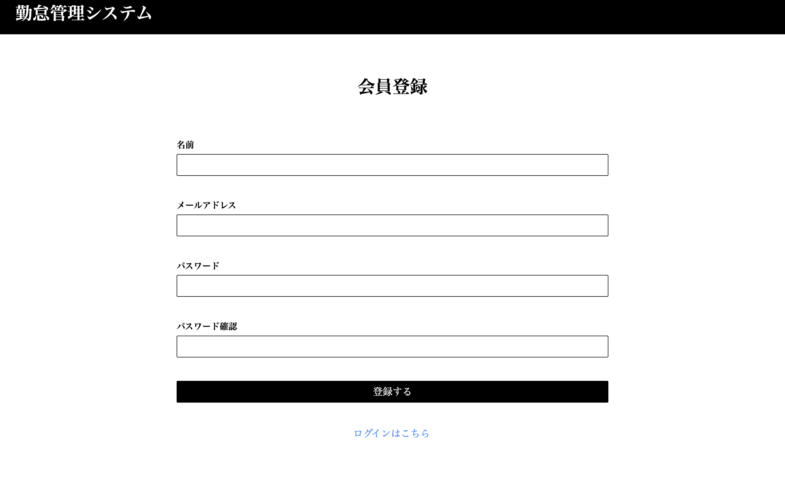
### ログイン画面
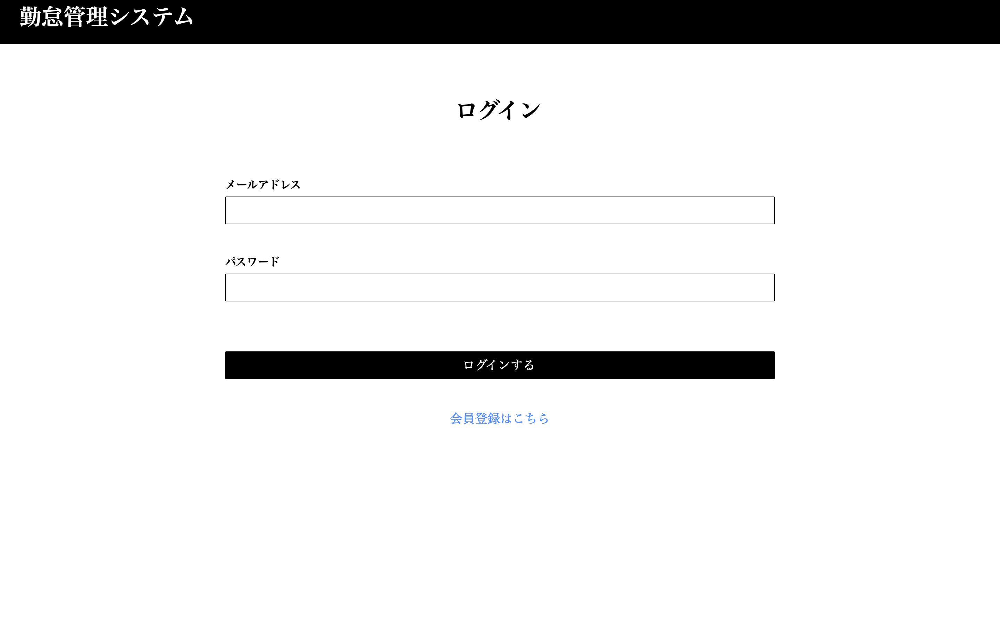
### 勤怠打刻画面
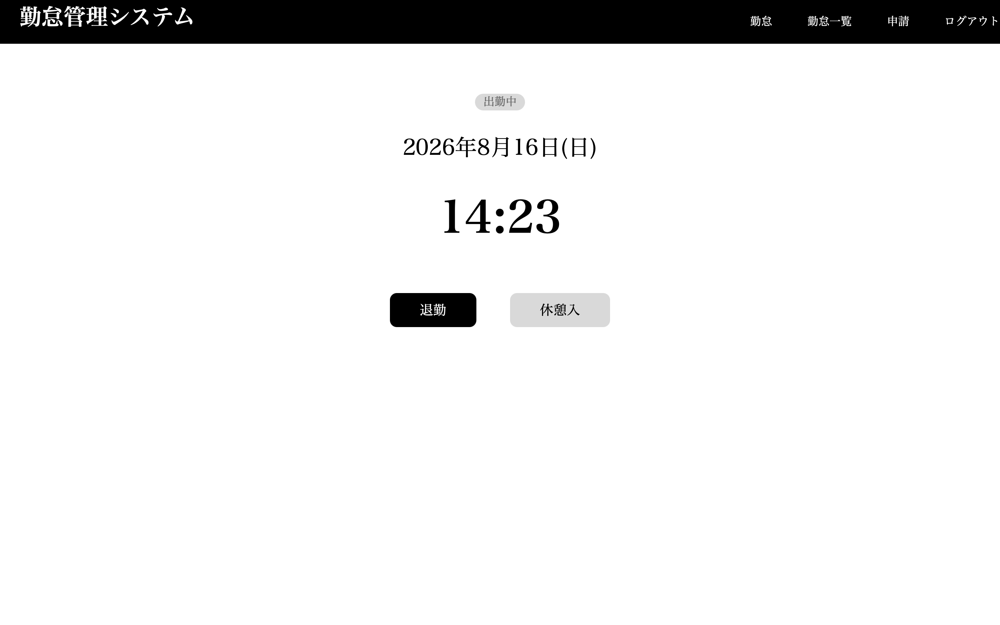
### 休憩打刻画面
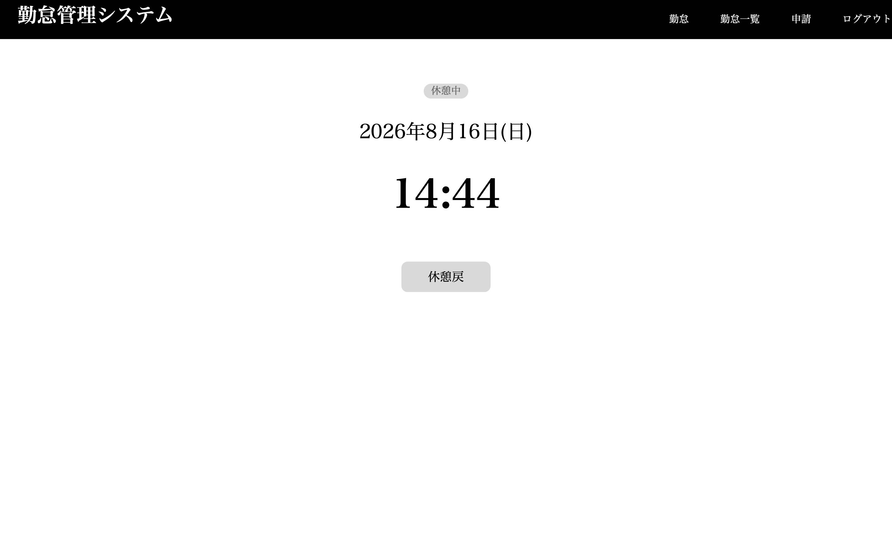
### ユーザー勤怠一覧画面
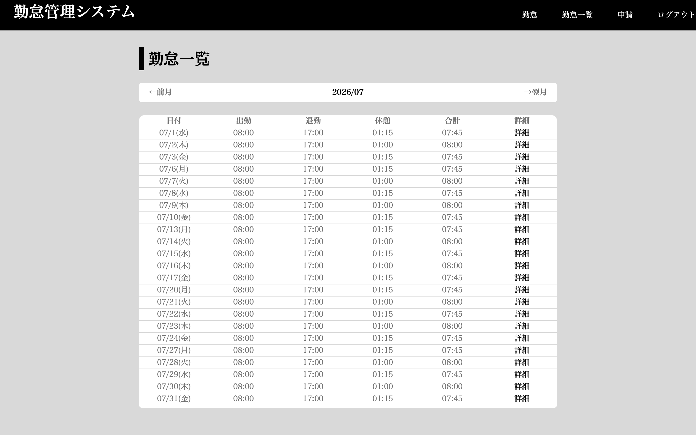
### 勤怠修正申請画面
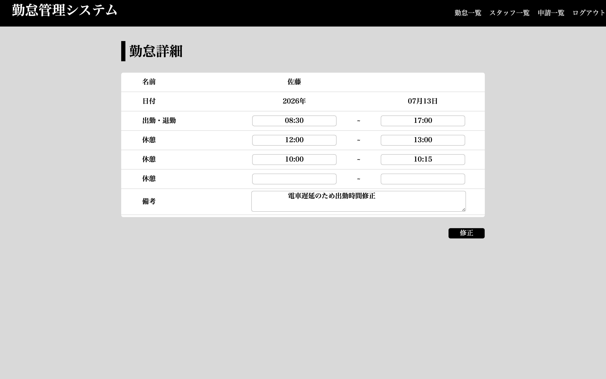
### 申請一覧画面
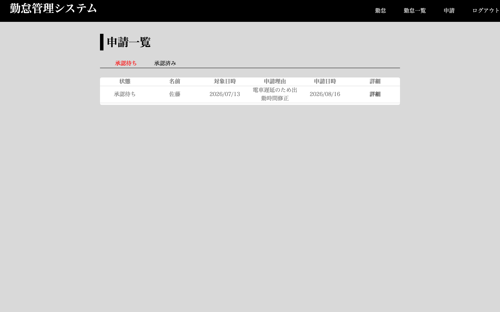
### 管理者 ユーザー一覧画面
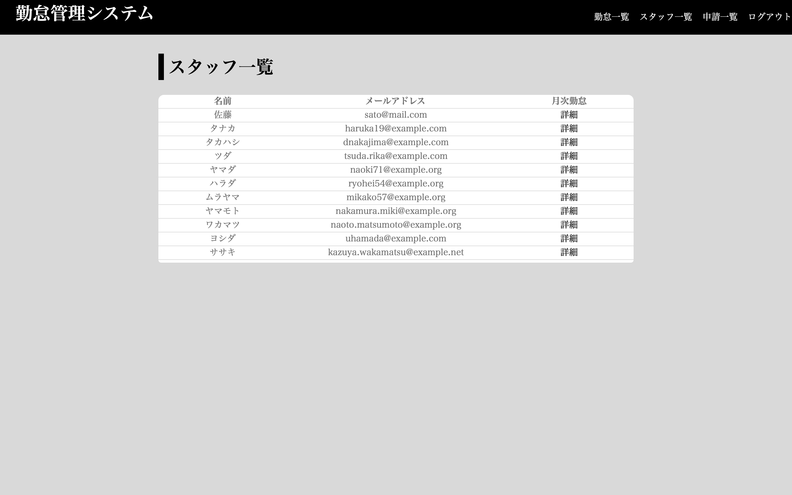
### 管理者 日別勤怠一覧画面
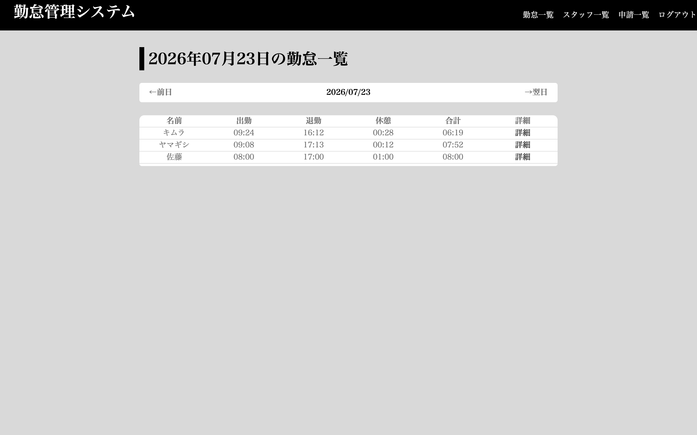
### 管理者 ユーザーの月別勤怠一覧画面
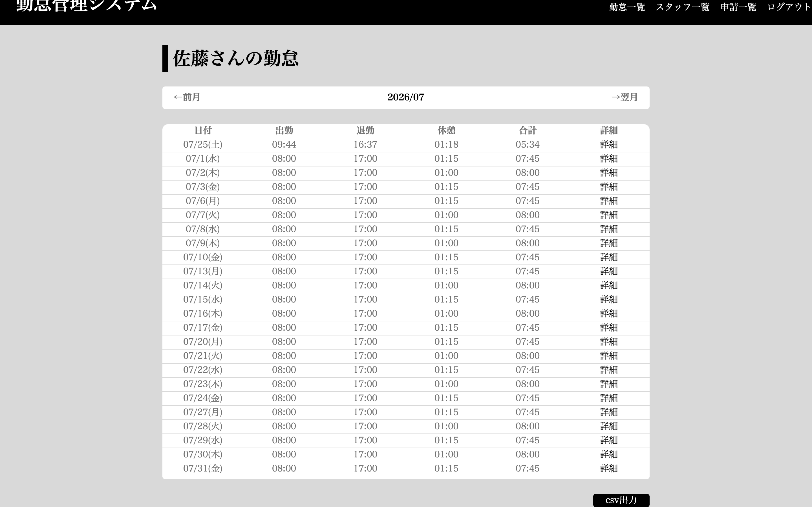
### 管理者 勤怠修正画面
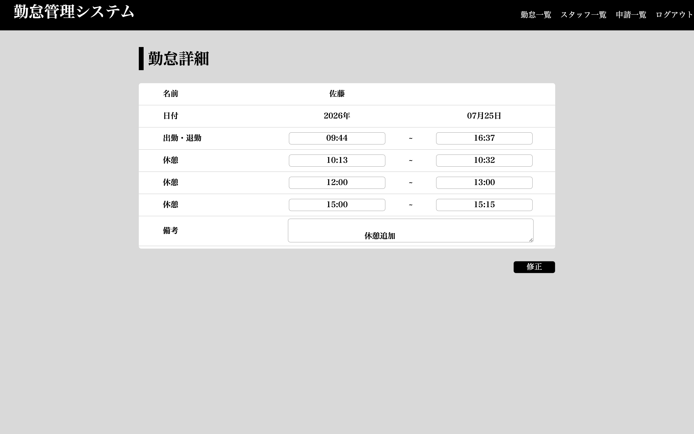
### 管理者 勤怠修正承認画面
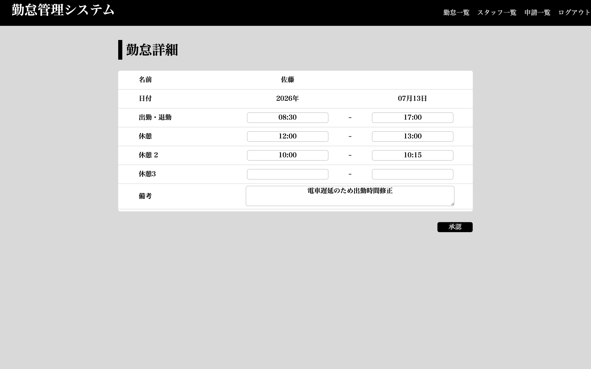

## 環境構築

### Dockerビルド

1. git clone git@github.com:hi-san10/ams.git

2. docker-compose up -d --build

*MYSQLは、OSによって起動しない場合があるのでそれぞれのPCに合わせて docker-compose.yml ファイルを編集してください。

### Laravel環境構築

1. docker-compose exec php bash

2. composer install

3. env.example ファイルから .env を作成し、docker-compose.ymlに応じて環境変数を変更

    - 開発環境ではMailtrapサービスを使ってメール機能を開発しています

    - Mailtrap url:[https://mailtrap.io](https://mailtrap.io)

    - アカウント作成後、ログインする

    - 左メニューにある Email Testing リンク、もしくは画面中央あたりの Email Testing の「Start Testing」ボタンをクリック

    - SMTP Settings タブをクリック

    - Integrations セレクトボックスで、Laravel 7.x,8.x を選択

    - copy ボタンをクリックして、クリップボードに .env の情報を保存

    - .envにコピーした情報を貼り付ける
        ```env
        MAIL_MAILER=smtp
        MAIL_HOST=sandbox.smtp.mailtrap.io
        MAIL_PORT=2525
        MAIL_USERNAME=
        MAIL_PASSWORD=
        MAIL_ENCRYPTION=tls

        MAIL_FROM_ADDRESS=
        MAIL_FROM_NAME="${APP_NAME}"
        ```
4. php artisan key:generate

5. php artisan migrate

6. php artisan db:seed


- ログイン用ユーザーのダミーデータ1件分
  - name: `佐藤`
  - email: `sato@mail.com`
  - password: `99999999`
- 管理者のダミーデータ1件分
  - name: `管理者`
  - email: `admin@mail.com`
  - password: `00000000`
- 一般ユーザー(スタッフ)のダミーデータ10件分
- 勤怠情報(出勤、退勤)のダミーデータ50件分
- 勤怠情報(休憩)のダミーデータ50件分


## 使用技術

- PHP 8.3
- Laravel 8.83
- MYSQL 8.0
- Docker / Docker Compose
- Nginx

## ER図


## テーブル仕様書


## 設計・実装のポイント
- Docker環境を構築し、環境差異なく動作するよう設計
- 打刻処理はバリデーションとビジネスロジックを分離
- 責務を分けることによりテストしやすい構成にしている

### バリデーションの分離例
勤怠修正申請では、`FormRequest`でバリデーションを行い、`Service`クラスにDB操作とビジネスロジックを集約しています。  
休憩は複数回登録に対応しているため、配列(`rests.*`)のバリデーション・登録処理も行っています

**バリデーション(`CorrectionRequest`)**
```php
// app/Http/Requests/CorrectionRequest.php
public function rules()
{
    return [
        'start' => ['date_format:H:i', 'before:end'],
        'end' => ['date_format:H:i'],
        'rests.*.start_time' => ['date_format:H:i', 'after:start', 'before:end', 'nullable',  
            'required_with:rests.*.end_time'],
        'rests.*.end_time' => ['date_format:H:i', 'after:start', 'before:end', 'nullable',  
            'required_with:rests.*.start_time'],
        'remarks' => ['required'],
    ];
}
```

**ビジネスロジック(`CorrectionService`)**
```php
// app/Services/CorrectionService.php
public function correction($request, $attendance)
{
    DB::transaction(function () use ($request, $attendance) {
        $correction = StampCorrectionRequest::create([
            'user_id' => Auth::id(),
            'attendance_id' => $attendance->id,
            'target_date' => $attendance->date,
            'request_date' => CarbonImmutable::today(),
            'request_reason' => $request->remarks,
        ]);

        $correction_attendance = CorrectionAttendance::create([
            'stamp_correction_request_id' => $correction->id,
            'start_time' => $request->start,
            'end_time' => $request->end,
        ]);

        // 空の休憩行はスキップして登録
        $rests = [];
        foreach ($request->rests as $rest) {
            if (blank($rest['start_time']) || blank($rest['end_time'])) {
                continue;
            }
            $rests[] = [
                'start_time' => $rest['start_time'],
                'end_time' => $rest['end_time'],
            ];
        }
        $correction_attendance->rests()->createMany($rests);
    });
}
```
## URL

・アプリケーション(開発環境):[http://localhost/](http://localhost/)

・phpMyAdmin:[http://localhost:8080](http://localhost:8080)

